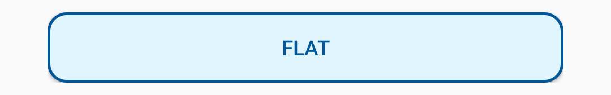
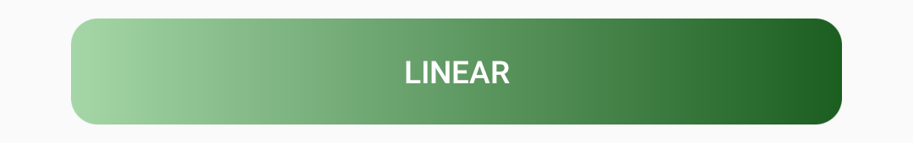
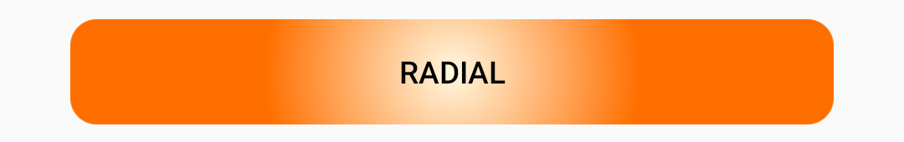

## Buttom
[](https://jitpack.io/#karacce/Buttom)

Buttom is a customizable button for Android written in kotlin.
## Installation
**1.** Add it in your root build.gradle file.
```groovy
allprojects {
	repositories {
		...
		maven { url 'https://jitpack.io' }
	}
}
```
**2.** Add the dependency
```groovy
dependencies {
	  implementation 'com.github.karacce:Buttom:v1.0'
}
```

## Usage
### Attributes
| XML Attribute | Description  |
| ------------- | ------------ |
| buttom_type   |Type of the button `flat` or `gradient` |
| gradient_type   |Type of the gradient `linear` or `radial` |
| gradient_orientation   |Orientation for *linear* gradient `top_bottom`, `right_left`, `bottom_top`, `left_right` |
| gradient_radius | Radius for *radial* gradient |
| background_color | Background color for `flat` button |
| gradient_start_color | Starting color for `gradient` button |
| gradient_end_color | Ending color for `gradient` button |
| stroke_size | Stroke size |
| stroke_color | Stroke color |
| corner_radius| Corner radius |

### Samples


```xml
        <com.karacce.buttom.Buttom
            android:layout_width="match_parent"
            android:layout_height="wrap_content"
            android:text="Flat"
            android:textColor="#01579B"

            app:buttom_type="flat"
            app:buttom_background_color="#E1F5FE"
            app:buttom_corner_radius="12dp"
            app:buttom_stroke_size="2dp"
            app:buttom_stroke_color="#01579B" />
```



```xml
        <com.karacce.buttom.Buttom
            android:layout_width="match_parent"
            android:layout_height="wrap_content"
            android:text="Linear"
            android:textColor="#FFFFFF"

            app:buttom_type="gradient"
            app:buttom_gradient_type="linear"
            app:buttom_gradient_orientation="left_right"
            app:buttom_gradient_start_color="#A5D6A7"
            app:buttom_gradient_end_color="#1B5E20"
            app:buttom_corner_radius="12dp"/>

```




```xml
        <com.karacce.buttom.Buttom
            android:layout_width="match_parent"
            android:layout_height="wrap_content"
            android:text="Radial"
            android:textColor="#000000"
	    
            app:buttom_type="gradient"
            app:buttom_gradient_type="radial"
            app:buttom_gradient_radius="225"
            app:buttom_gradient_start_color="#FFF8E1"
            app:buttom_gradient_end_color="#FF6F00"
            app:buttom_corner_radius="12dp"/>

```

